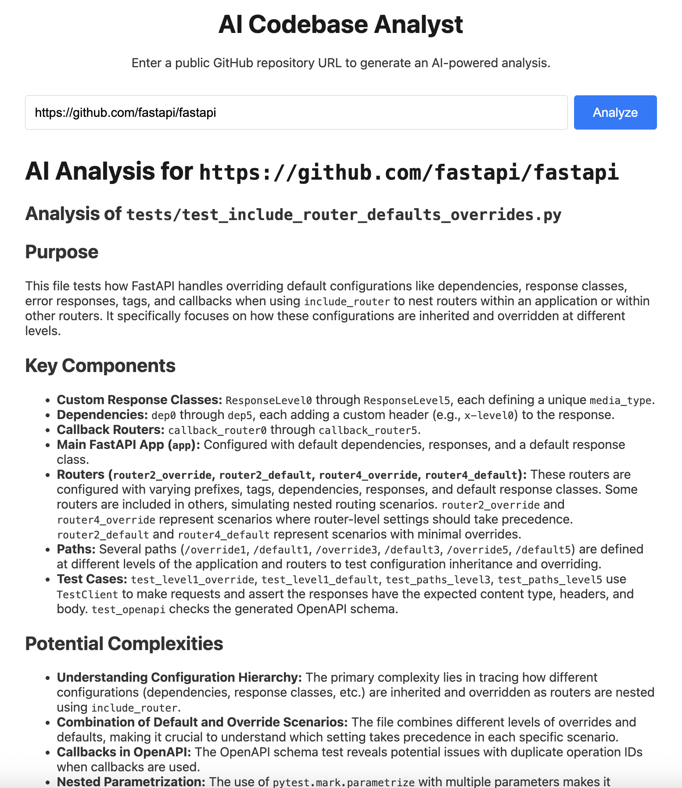
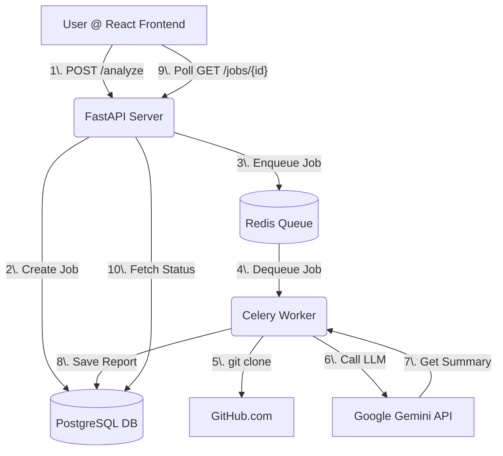

# AI Codebase Analyst 🚀

[](https://opensource.org/licenses/MIT)
[](https://www.python.org/)
[](https://reactjs.org/)
[](https://fastapi.tiangolo.com/)

An open-source tool that uses generative AI to analyze public GitHub repositories and generate high-level summaries of the codebase.

### **Live Demo is WIP** check out [local Deployment](#local-development-setup)



---

## How It Works

This application uses a modern, asynchronous, distributed architecture to handle code analysis without blocking the user.

1.  A **React** frontend captures a GitHub URL from the user.
2.  A **FastAPI** backend receives the request, creates a job entry in the database, and enqueues the analysis job in a **Redis** queue.
3.  A **Celery** worker, running as a separate process, picks up the job from the queue.
4.  The worker clones the repository, identifies key source files, and sends their content to the **Google Gemini API** for analysis.
5.  The AI-generated report is saved back to the database.
6.  The React frontend polls the API for the job status and displays the final, formatted report once complete.

### Architecture Diagram




## Tech Stack

-   **Frontend:** React (Vite), JavaScript, `pnpm`
-   **Backend:** Python, FastAPI
-   **Task Queue:** Celery, Redis
-   **Database:** SQLAlchemy ORM, PostgreSQL (Production), SQLite (Local Dev)
-   **AI:** Google Gemini API
-   **Deployment:**
    -   Frontend on **Vercel**
    -   Backend (API, Worker, DB, Redis) on **Render**


## Features

-   **AI-Powered Analysis:** Leverages large language models to understand and summarize code.
-   **Asynchronous Processing:** Long-running analysis tasks don't freeze the UI.
-   **Full-Stack Architecture:** Demonstrates a decoupled frontend and backend.
-   **Interactive UI:** Clean, responsive interface for submitting jobs and viewing reports.
-   **Scalable Backend:** The worker-queue pattern allows for easy scaling of analysis tasks.

### Future Improvements
-   [ ] Per-IP rate limiting to prevent abuse.
-   [ ] Support for private repositories via GitHub OAuth.
-   [ ] More detailed analysis, such as dependency graphs or code quality metrics.

## Local Development Setup

### Prerequisites
-   Python 3.10+
-   Node.js and `pnpm`
-   Docker (for Redis & PostgreSQL) or local installations of each.

### 1. Backend Setup

```bash
# Clone the repository
git clone https://github.com/YOUR_GITHUB_USERNAME/codebase-analyzer.git
cd codebase-analyzer

# Create and activate a clean virtual environment
python -m venv venv
source venv/bin/activate

# Install Python dependencies
pip install -r requirements.txt

# Start Redis (using Docker is easiest)
docker run -d -p 6379:6379 redis

# Set required environment variables
export GOOGLE_API_KEY="your_gemini_api_key_here"

# --- Terminal 1: Start the Celery worker ---
celery -A app.core.celery_app worker --loglevel=info

# --- Terminal 2: Start the FastAPI server ---
uvicorn app.main:app --reload
```

### 2. Frontend Setup

```bash
# --- Terminal 3: Navigate to the frontend directory ---
cd frontend

# Install dependencies using pnpm
pnpm install

# Start the React dev server
pnpm dev
```
The application will now be available at `http://localhost:5173`, communicating with the backend at `http://localhost:8000`.

## License

This project is licensed under the MIT License. See the [LICENSE](LICENSE) file for details.
